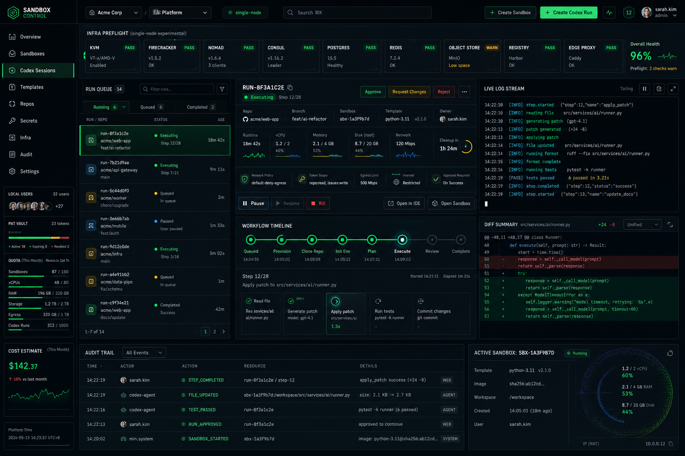

# Sandbox Control

Sandbox Control 是一个多人内部控制台，用于实验性自建 E2B 风格沙箱和远程 Codex 会话管理。项目使用 FastAPI 后端和 React/Vite 前端，提供双语 UI、用户级 Codex 登录状态、sandbox 生命周期控制、Codex 运行审核、日志、diff、审计事件，以及独立对话页。



## 已实现能力

- 本地账号登录，包含 `admin`、`operator`、`viewer` 角色。
- 每用户独立的加密密钥摘要，用于 Git PAT、Codex/ChatGPT token 和 API key 备用登录。
- Codex auth 接口，支持每用户 ChatGPT 登录流程、取消、退出和 OpenAI API key 备用路径。
- Codex 运行队列、运行详情、工作流时间线、审批控制、日志、diff 摘要和审计事件。
- 独立 Codex 对话页，包含消息流、工具审批卡片、终端流和文件/diff 侧栏。
- 单机基础设施预检，覆盖 Linux、CPU 虚拟化、`/dev/kvm`、Firecracker、Docker、cgroup、TUN/TAP、磁盘和默认端口。
- 已实现产品界面的完整中英文 UI 文案。
- Firecracker 主机安装脚本和面向本地/内部部署的 Docker Compose 文件。
- 实验版单机 infra 组件：宿主机 Nomad、Postgres、Redis、MinIO、registry、Consul 和 Caddy edge proxy。

## 为什么 KVM / Firecracker 重要

KVM 是 Linux 内核提供的硬件虚拟化接口。Firecracker 是基于 KVM 启动 microVM 的轻量运行时。E2B 风格沙箱依赖 VM 级隔离。即使 Docker 能正常工作，单台服务器也可能因为没有 `/dev/kvm`、CPU 虚拟化扩展、TUN/TAP 网络能力或必要的 Linux 内核权限而无法运行 Firecracker 沙箱。

如果这些检查失败，Sandbox Control 仍然可以作为控制台运行，但 Infra 页面必须明确显示 Firecracker 沙箱能力被阻塞。

## 本地开发

```powershell
uv sync --dev
cd apps/web
npm install
npm run build
cd ../..
uv run uvicorn sandbox_control.main:app --app-dir apps/api --host 0.0.0.0 --port 8080
```

默认开发登录：

- 用户名：`admin`
- 密码：`sandbox-control-admin`

## 单机 Infra 安装

在目标 Ubuntu 服务器上执行：

```bash
cd /opt/sandbox-control
sudo bash deploy/scripts/install-infra.sh
```

该脚本会安装 Firecracker、`jailer` 和宿主机 Nomad dev agent，验证 `/dev/kvm`，然后通过 Docker Compose 启动控制面和 infra 组件。控制台默认仍然访问 `http://<server>:8080`；Caddy edge proxy 暴露在 `:8088`。

## 仓库结构

- `apps/api` - FastAPI 应用、Beta 内存存储、provider adapter、Codex auth 管理器、测试。
- `apps/web` - React/Vite TypeScript 控制台和对话 UI。
- `deploy` - Docker Compose 和单机部署辅助脚本。
- `docs` - 双语架构、部署和运维说明。

## 安全说明

不要提交 `.env`、真实 ChatGPT/Codex token、OpenAI API key、Git PAT、服务器密码或复制出来的 Codex `auth.json`。真实部署时必须设置 `SANDBOX_CONTROL_SECRET_KEY` 用于服务端加密。

## 许可证

MIT
