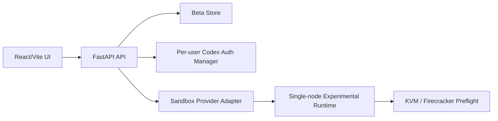

# Architecture

Sandbox Control is split into a Python control API and a React operator console.

## Runtime Boundaries

The control plane can run without Firecracker. Firecracker-backed sandboxes require Linux KVM support, exposed CPU virtualization, `/dev/kvm`, network devices, and enough disk/memory. The Infra page reports blockers instead of hiding them.

## Codex Identity

Each user has an isolated Codex identity context. The primary path is ChatGPT login. OpenAI API key fallback is available when interactive login is blocked.

## Conversation Page

The conversation page is separate from the run dashboard. It presents messages, Codex tool calls, approval cards, terminal output, and file/diff context in one workflow surface.
