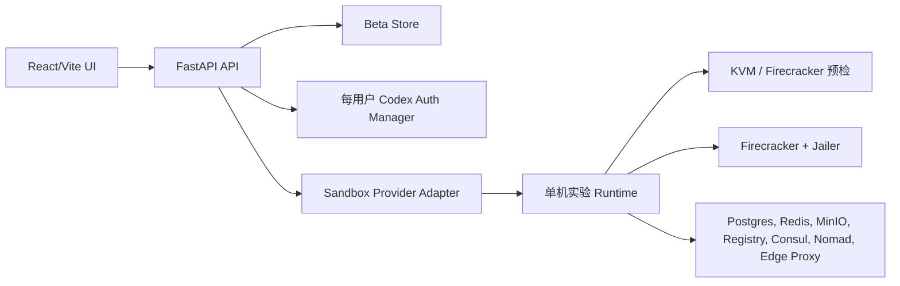

# 架构

Sandbox Control 分为 Python 控制 API 和 React 运维控制台。

## 运行边界

控制面可以在没有 Firecracker 的情况下运行。Firecracker 沙箱需要 Linux KVM、CPU 虚拟化扩展、`/dev/kvm`、网络设备以及足够磁盘/内存。Infra 页面必须显示阻塞原因，不能隐藏失败。

## 单机 Infra

`deploy/scripts/install-firecracker.sh` 会从官方 release artifact 安装 `firecracker` 和 `jailer`。`deploy/scripts/install-infra.sh` 会完成主机包安装、Firecracker 安装、preflight 和 Docker Compose stack 启动。

Compose stack 包含 Postgres、Redis、MinIO、registry、Consul、Nomad、Caddy edge proxy 和 Sandbox Control 服务。

## Codex 身份

每个用户拥有隔离的 Codex 身份上下文。主路径是 ChatGPT 登录；当交互式登录受限时，可使用 OpenAI API key 备用路径。

## 对话页

对话页与 run dashboard 分离。它在同一工作流界面中展示消息、Codex 工具调用、审批卡片、终端输出和文件/diff 上下文。
